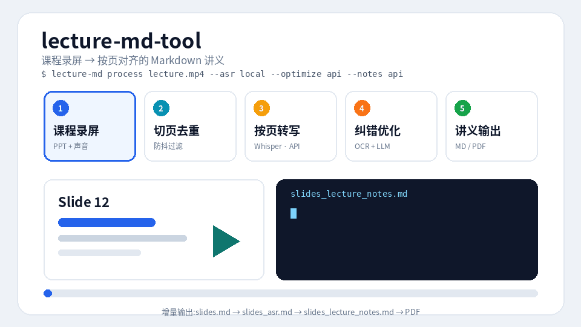
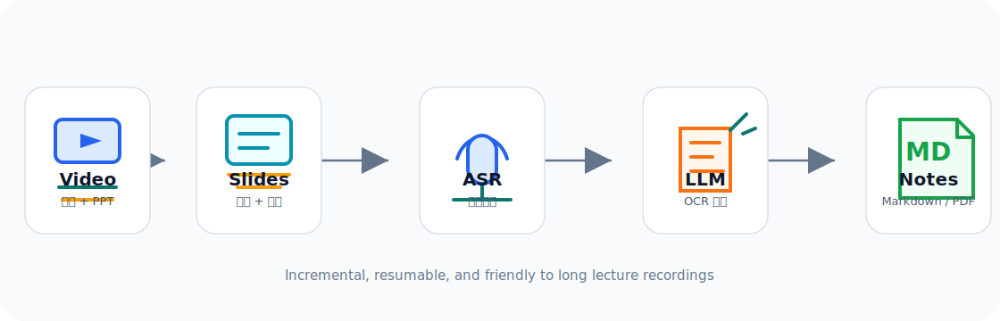

# lecture-md-tool

<p align="center">
  
</p>

<p align="center">
  <b>把老师的 PPT 录屏课，自动整理成按页对应的 Markdown 讲义。</b>
</p>

<p align="center">
  <a href="https://www.python.org/"></a>
  <a href="LICENSE"></a>
  <a href="#配置-api-后端"></a>
</p>

`lecture-md-tool` 面向“讲课声音 + PPT 录屏”的课程视频：自动切分 PPT 页、按页切音频、执行 ASR 转写，再用 OCR 和大模型纠错，最后生成适合复习的精炼讲义稿，并可导出 PDF。

<p align="center">
  
</p>

## 功能特性

- **PPT 页切分**：基于 [slidegeist](https://pypi.org/project/slidegeist/) 检测翻页，提取每页截图和时间轴。
- **防抖去重**：过滤鼠标移动、压缩噪声、短暂翻回、播放器抖动造成的假切页，并保护渐进式 PPT 动画页。
- **可选 ASR 后端**：支持本地 `faster-whisper`，也支持 OpenAI-compatible API 的音频模型。
- **OCR + LLM 纠错**：用 RapidOCR 提取 PPT 页文字，辅助大模型修正专业术语、同音字、公式和断句。
- **讲义稿生成**：去口语化、公式 Markdown/LaTeX 化，每页输出精炼讲义，同时保留校正转写和 ASR 原文。
- **断点续跑**：中间文件增量保存，网络错误、限流或中断后可继续跑。
- **流水线并行**：`postprocess` 监视模式可以在本地 ASR 批量运行时并行调用 API 做纠错和讲义。
- **PDF 导出**：用无头 Chrome/Edge 把讲义 Markdown 渲染成 A4 PDF。
- **跨平台脚本**：提供 PowerShell 和 shell 示例，Windows、macOS、Linux 都可用。

## 工作流程

<p align="center">
  
</p>

```text
视频录屏
  -> slidegeist 翻页检测
  -> 防抖去重
  -> ffmpeg 按页切音频
  -> ASR 转写
  -> OCR + LLM 纠错
  -> 讲义稿生成
  -> slides_lecture_notes.md / PDF
```

## 安装

依赖 Python 3.10+ 和 [ffmpeg](https://ffmpeg.org/)（包含 `ffprobe`）。

```bash
git clone https://github.com/Decent898/lecture-md-tool.git
cd lecture-md-tool
python -m venv .venv
source .venv/bin/activate        # Windows: .\.venv\Scripts\Activate.ps1
pip install -e ".[all]"
```

可选依赖按需安装：

| 安装方式 | 包含内容 |
| --- | --- |
| `pip install -e .` | 核心流水线：PPT 切分 + API ASR |
| `pip install -e ".[local]"` | 本地 Whisper ASR：`faster-whisper` |
| `pip install -e ".[ocr]"` | OCR 辅助纠错：`rapidocr-onnxruntime` |
| `pip install -e ".[gui]"` | PyQt6 桌面界面 |
| `pip install -e ".[all]"` | 全部功能 |

Windows 上如果 `ffmpeg` 不在 PATH 中，可先执行：

```powershell
$env:PATH="C:\path\to\ffmpeg\bin;$env:PATH"
```

## 配置 API 后端

本工具兼容任意 OpenAI 风格的 `/v1/chat/completions` 接口，例如 OpenAI、DeepSeek、MiMo、Ollama、vLLM 等。不使用 API 功能时（如 `--asr local --optimize none --notes none`）无需配置密钥。

环境变量：

| 变量 | 说明 | 默认值 |
| --- | --- | --- |
| `LECTURE_MD_API_KEY` | API 密钥，也接受 `OPENAI_API_KEY` | 无 |
| `LECTURE_MD_BASE_URL` | API 地址 | `https://api.openai.com/v1` |
| `LECTURE_MD_ASR_MODEL` | 支持 `input_audio` 的音频对话模型 | `gpt-4o-mini-audio-preview` |
| `LECTURE_MD_CHAT_MODEL` | 用于纠错和讲义生成的文本模型 | `gpt-4o-mini` |
| `LECTURE_MD_TERMS` | 课程术语表，逗号分隔 | 空 |

macOS/Linux 示例：

```bash
export LECTURE_MD_API_KEY="sk-..."
export LECTURE_MD_BASE_URL="https://api.openai.com/v1"
export LECTURE_MD_TERMS="流水线, 数据冒险, Cache, 虚拟存储"
```

Windows PowerShell 示例（以 MiMo 为例）：

```powershell
$env:LECTURE_MD_API_KEY = "your-key"
$env:LECTURE_MD_BASE_URL = "https://token-plan-cn.xiaomimimo.com/v1"
$env:LECTURE_MD_ASR_MODEL = "mimo-v2.5-asr"
$env:LECTURE_MD_CHAT_MODEL = "mimo-v2.5-pro"
```

> 注意：API ASR 使用 `/v1/chat/completions` 的 `input_audio` 消息格式，不是 `/v1/audio/transcriptions`。不要把密钥写进代码或提交到仓库。

## 快速开始

启动桌面界面：

```bash
lecture-md-gui
# or
lecture-md gui
```

处理单个视频，本地 ASR，全程不调用 API：

```bash
lecture-md process --video lecture.mp4 --output-root ./out \
  --asr local --optimize none --notes none
```

本地 ASR + API 纠错 + API 讲义稿：

```bash
lecture-md process --video lecture.mp4 --output-root ./out \
  --asr local --optimize api --notes api
```

批量处理某个文件夹中今天录制的视频：

```bash
lecture-md process --input-dir ~/Downloads --today --output-root ./out --skip-existing
```

本地 ASR 批量运行时，另开终端并行执行 API 后处理：

```bash
lecture-md postprocess --output-root ./out --watch --jobs 2
```

把讲义导出为 PDF：

```bash
lecture-md to-pdf --input-root ./out --output-dir ./pdf
```

## 命令一览

统一入口 `lecture-md`，等价于 `python -m lecture_md`：

| 子命令 | 作用 |
| --- | --- |
| `process` | 完整流水线：切页 -> 去重 -> ASR -> 纠错 -> 讲义 |
| `postprocess` | 监视输出目录，对已完成 ASR 的视频并行执行纠错 + 讲义生成 |
| `asr` | 单步：对一个视频按页转写 |
| `optimize` | 单步：OCR + LLM 纠错一个 ASR Markdown |
| `notes` | 单步：生成讲义稿 |
| `dedupe` | 单步：清理 `slides.md` 中的不稳定切页 |
| `merge-hls` | 把本地 HLS `.ts` 分片合并成 `.mp4` |
| `to-pdf` | 把讲义 Markdown 渲染成 PDF |
| `gui` | 启动 PyQt6 桌面界面 |

桌面入口 `lecture-md-gui` 和 `lecture-md gui` 会调用同一套 CLI 流水线，适合不想手写参数时使用。

各子命令均支持 `--help` 查看全部参数。

## `process` 常用参数

| 参数 | 默认 | 说明 |
| --- | --- | --- |
| `--asr api\|local` | `api` | ASR 后端 |
| `--optimize api\|none` | `api` | 是否做 OCR + LLM 纠错 |
| `--notes api\|none` | `none` | 是否生成讲义稿 |
| `--file-glob` | `*` | `--input-dir` 模式下的视频文件通配符 |
| `--include-name 文本` | 无 | 只处理文件名包含该文本的视频，可重复指定多门课程 |
| `--today` | 关 | 只处理今天修改过的视频 |
| `--skip-existing` | 关 | 跳过已有最终输出的视频 |
| `--dry-run` | 关 | 只打印将要处理的视频列表 |
| `--scene-threshold` | `0.001` | 翻页检测灵敏度，越小越敏感 |
| `--min-scene-len` | `5` | 合并过短片段，单位秒 |
| `--dedupe-mode debounce\|merge` | `debounce` | 防抖模式或激进视觉合并模式 |
| `--dedupe-stable-seconds` | `6` | 防抖模式下，只折叠短于该时长的重复/翻回切分 |
| `--asr-language` | `zh` | ASR 语言，本地模式可用 `auto` |
| `--local-asr-model` | `small` | faster-whisper 模型 |
| `--local-asr-device` | `cpu` | 本地推理设备，可设为 `cuda` |
| `--max-chunk-seconds` | `90` | 按页音频块上限，兼顾 API 限制和内存 |
| `--terms` | 空 | 课程术语表，覆盖 `LECTURE_MD_TERMS` |
| `--sleep` | `5` | API 调用间隔，降低限流概率 |

## 输出文件

每个视频生成独立输出目录：

| 文件 | 内容 |
| --- | --- |
| `slides/` | 每页 PPT 截图 |
| `slides.md` | 去重后的 PPT 时间轴 |
| `slides_raw.md` | 去重前的原始时间轴 |
| `slides_dedupe.json` | 去重决策与合并明细 |
| `slides_asr.md` | 按页 ASR 转写 |
| `asr.json` | ASR 原始记录与元数据 |
| `slides_optimized.md` | 纠错后的转写 |
| `optimization.json` | OCR 文本、原始转写、校正转写与修正点 |
| `slides_lecture_notes.md` | 讲义稿 + 校正转写 + ASR 原文 |
| `lecture_notes.json` | 逐页讲义记录 |
| `batch.log` | 命令日志 |

批量模式还会在输出根目录生成 `manifest.json` 和 `index.md` 索引。

## 周期性批量示例

`scripts/` 目录提供可直接使用的包装脚本：

```bash
./scripts/run_one.sh lecture.mp4 ./out --asr local --optimize none
./scripts/run_today.sh ~/Downloads ./out
```

```powershell
.\scripts\run_one.ps1 -Video "C:\path\to\lecture.mp4" -OutputRoot ".\out"
.\scripts\run_today.ps1 -InputDir "$env:USERPROFILE\Downloads" -OutputRoot ".\out"

# 周期性课程录屏批处理：按课程名过滤，本地 ASR + API 纠错 + 讲义
.\scripts\run_courses.ps1 -InputDir "E:\Recordings" -Courses "计算机组成与体系结构","软件工程基础" -DryRun
.\scripts\run_courses.ps1 -InputDir "E:\Recordings" -Courses "计算机组成与体系结构","软件工程基础"
```

## 常见问题

**翻页检测太碎 / 漏页？** 调节 `--scene-threshold`（越小越敏感）与 `--min-scene-len`。两小时课程出现成百上千页时，保持去重开启并调大 `--dedupe-stable-seconds`；如果可以接受更激进的视觉合并，可使用 `--dedupe-mode merge`。

**本地 ASR 太慢？** 用 `--local-asr-device cuda` 启用 GPU，或换更小的模型 `--local-asr-model tiny/base`。首次运行会自动下载所选 Whisper 模型。

**API 频繁 429？** 调大 `--sleep` 与 `--retry-sleep`。所有步骤都会增量保存，可放心中断后重跑同一条命令续跑。

**纠错术语不准？** 通过 `LECTURE_MD_TERMS` 或 `--terms` 提供课程术语表，例如 `"流水线, 数据冒险, Cache 一致性"`。

**渐进式 PPT（逐条出现的要点）被合并了？** 默认 `debounce` 模式已对此做保护：长片段即使视觉相似也不折叠。如仍有问题，调小 `--dedupe-stable-seconds`。

## 许可证

[MIT](LICENSE)
